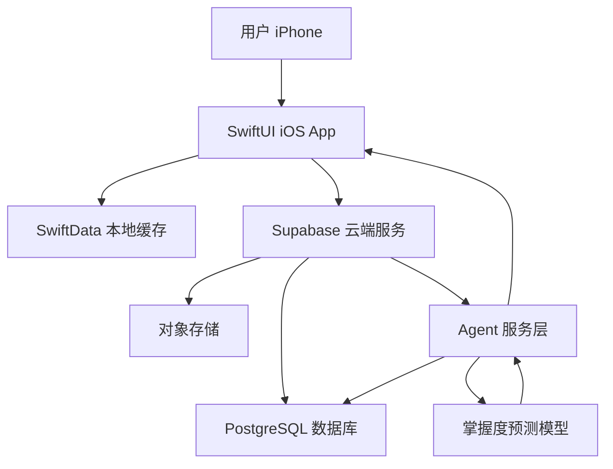
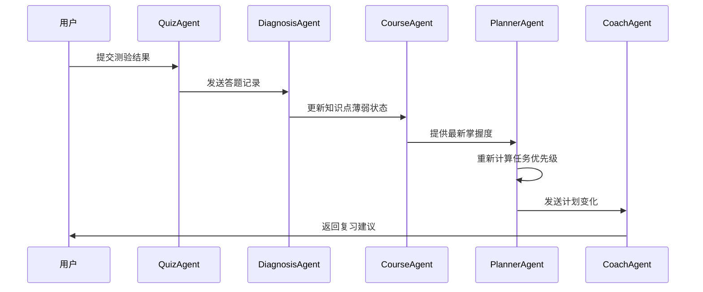
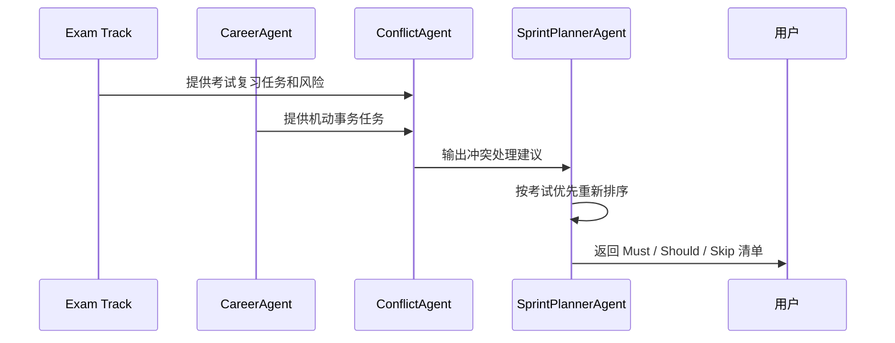

# 04 技术架构与课程映射

文档版本：v0.1  
日期：2026-05-01

## 1. 总体架构

FinalPilot 分为四层：

```text
iOS 客户端层
云端服务层
多智能体协作层
神经网络模型层
```

架构图：



## 2. iOS 客户端层

职责：

- 展示课程、任务、练习和分析页面。
- 保存本地缓存。
- 调用云端 API。
- 调用 Core ML 模型。
- 发送本地复习提醒。

建议模块：

```text
FinalPilotApp
├── Features
│   ├── Dashboard
│   ├── Courses
│   ├── Planner
│   ├── Quiz
│   └── Analytics
├── Models
├── Services
├── Agents
└── Resources
```

## 3. 云计算层

云计算在本项目中的作用：

- 让用户数据不只存在手机本地。
- 支持跨设备同步。
- 承担计划生成、诊断等计算任务。
- 未来可接入大模型和资料解析。

推荐服务：

- Supabase Auth：用户登录。
- Supabase Database：课程、任务、答题记录。
- Supabase Storage：上传课程资料。
- Edge Functions：运行计划生成和诊断逻辑。

## 4. 多智能体系统设计

本项目中的“智能体”可以先落地为后端服务中的多个协作类，不必一开始做成独立进程。

### 4.1 PlannerAgent

职责：

- 根据考试日期、可用时间、掌握度生成复习计划。
- 调整每日任务优先级。

输入：

- 课程列表
- 知识点掌握度
- 考试日期
- 用户每日可学习时间

输出：

- 今日任务
- 7 天计划

### 4.2 CourseAgent

职责：

- 管理课程知识结构。
- 更新知识点状态。
- 判断章节完成度。

### 4.3 QuizAgent

职责：

- 根据薄弱知识点推荐题目。
- 组织小测验。
- 记录答题结果。

### 4.4 DiagnosisAgent

职责：

- 分析错题。
- 判断薄弱知识点。
- 生成学习风险报告。

### 4.5 CoachAgent

职责：

- 将系统分析结果转成用户能理解的建议。
- 给出简短、可执行的复习提醒。

示例：

> 今天优先处理神经网络的反向传播。这个知识点错误率高，而且距离考试较近，建议先复习计算流程，再完成 5 道题。

### 4.6 CareerAgent

职责：

- 管理春季机动事务事件。
- 生成最低限度机动事务任务。
- 整理 FinalPilot 项目展示话术。
- 判断设计复盘任务是否可以延期。

### 4.7 ConflictAgent

职责：

- 检测考试复习任务和机动事务任务之间的冲突。
- 按“考试优先，设计复盘保温”的原则重新排序。
- 输出延期、压缩或合并任务建议。

## 5. Agent 协作流程



双轨调度流程：



## 6. 神经网络模块

模型名称：MasteryPredictor

任务：

预测用户对某个知识点的掌握程度。

输入特征：

```text
recent_accuracy
review_count
days_since_last_review
average_time_spent
confidence_score
topic_difficulty
```

输出：

```text
mastery_score
```

解释：

`mastery_score` 是 0 到 1 之间的分数。越接近 1，表示系统越认为用户已经掌握该知识点。

推荐模型：

- 小型 MLP
- 输入层：6 个特征
- 隐藏层：16 到 32 个神经元
- 输出层：1 个分数

首版可先使用规则算法模拟，后续接入 Core ML 模型。

## 7. 三门课程映射

### 7.1 多智能体系统

项目体现：

- 多 Agent 分工。
- Agent 协作流程。
- 任务分解和计划调整。
- 智能体之间的信息传递。
- 考试任务与里程碑任务的冲突检测。

可讲技术点：

- Agent role design
- Task decomposition
- Coordination
- Feedback loop

### 7.2 云计算

项目体现：

- 云数据库。
- 用户认证。
- 云端文件存储。
- Serverless 函数。
- 客户端与云端同步。

可讲技术点：

- BaaS
- Serverless
- REST API
- Data synchronization
- Scalability

### 7.3 神经网络

项目体现：

- 掌握度预测模型。
- 训练数据构造。
- Core ML 部署。
- 个性化推荐。

可讲技术点：

- MLP
- Feature engineering
- Model inference
- On-device AI

## 8. 设计复盘展示话术

可以这样介绍：

> FinalPilot 不是普通待办事项 App，而是一个面向期末复习场景的智能学习系统。我把系统拆成 PlannerAgent、QuizAgent、DiagnosisAgent、CourseAgent 和 CoachAgent，让不同智能体分别负责计划、题目、诊断、知识结构和反馈。云端负责用户数据同步、计划生成和后续大模型扩展；神经网络模块用于根据答题记录和复习行为预测知识点掌握度，从而动态调整后续复习计划。
