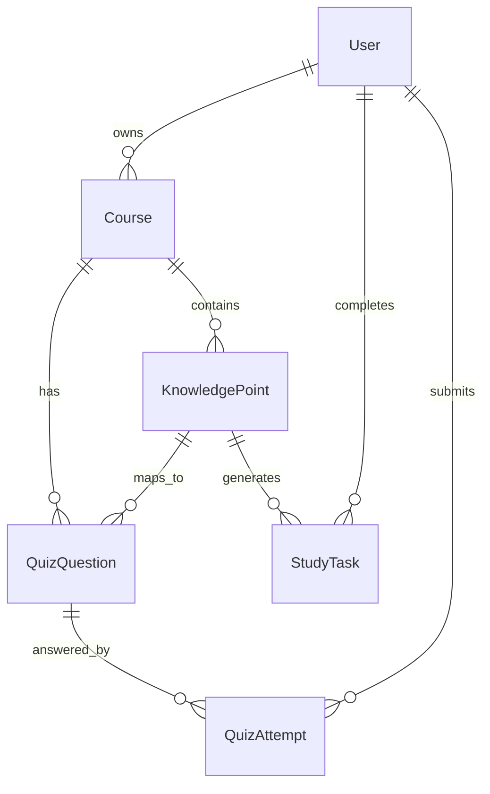

# 05 数据模型与题库规划

文档版本：v0.1  
日期：2026-05-01

## 1. 数据设计原则

首版数据模型要服务于一个核心闭环：

课程 -> 知识点 -> 任务 -> 测验 -> 答题记录 -> 掌握度更新。

不要一开始把表设计得过度复杂。先保证核心流程能跑通，后续再扩展上传资料、LLM 生成题目和多人学习功能。

## 2. 核心实体

### 2.1 User

用户信息。

字段：

```text
id
name
email
daily_study_minutes
created_at
```

### 2.2 Course

课程信息。

字段：

```text
id
user_id
name
exam_date
difficulty
target_score
overall_progress
created_at
```

### 2.3 KnowledgePoint

知识点信息。

字段：

```text
id
course_id
title
chapter
difficulty
mastery_score
status
last_reviewed_at
created_at
```

### 2.4 StudyTask

复习任务。

字段：

```text
id
user_id
course_id
knowledge_point_id
date
task_type
duration_minutes
priority_score
status
created_at
```

### 2.5 QuizQuestion

题目信息。

字段：

```text
id
course_id
knowledge_point_id
type
question
options
answer
explanation
difficulty
created_at
```

### 2.6 QuizAttempt

答题记录。

字段：

```text
id
user_id
question_id
knowledge_point_id
selected_answer
is_correct
time_spent_seconds
confidence
created_at
```

## 3. 关系设计



## 4. 三门课知识点规划

### 4.1 多智能体系统

章节与知识点：

- Agent 基本概念
- 感知、决策与行动
- 多智能体通信
- 协作与协调
- 任务分解
- 博弈与策略
- 一致性与共识
- 多智能体系统评估

### 4.2 云计算

章节与知识点：

- IaaS、PaaS、SaaS
- 虚拟化
- 容器与 Docker
- Kubernetes 基础
- Serverless
- 云存储
- 负载均衡
- 自动扩缩容
- 监控与日志
- 云安全基础

### 4.3 神经网络

章节与知识点：

- 感知机
- 激活函数
- 损失函数
- 梯度下降
- 反向传播
- 过拟合与正则化
- CNN
- RNN
- Transformer
- 模型评估

## 5. 题库策略

首版每门课准备 20 到 30 道题。

题型比例：

- 选择题：60%
- 判断题：25%
- 简答题：15%

题目难度：

- easy：基础概念
- medium：对比理解
- hard：应用分析

首版自动评分范围：

- 选择题自动评分。
- 判断题自动评分。
- 简答题由用户自评，后续再接入 AI 批改。

## 6. 掌握度更新规则

首版可以用规则算法：

```text
如果答对且自信度高：mastery_score + 0.08
如果答对但自信度低：mastery_score + 0.03
如果答错：mastery_score - 0.10
如果超过 3 天未复习：mastery_score - 0.05
```

限制：

```text
mastery_score 最低为 0
mastery_score 最高为 1
```

后续神经网络版本用模型输出替换规则算法。

## 7. 数据种子文件

当前种子数据文件：

```text
data/knowledge_base_seed.json
```

用途：

- 给 iOS 本地 MVP 导入课程和知识点。
- 给后端数据库初始化。
- 给题库设计提供结构参考。

