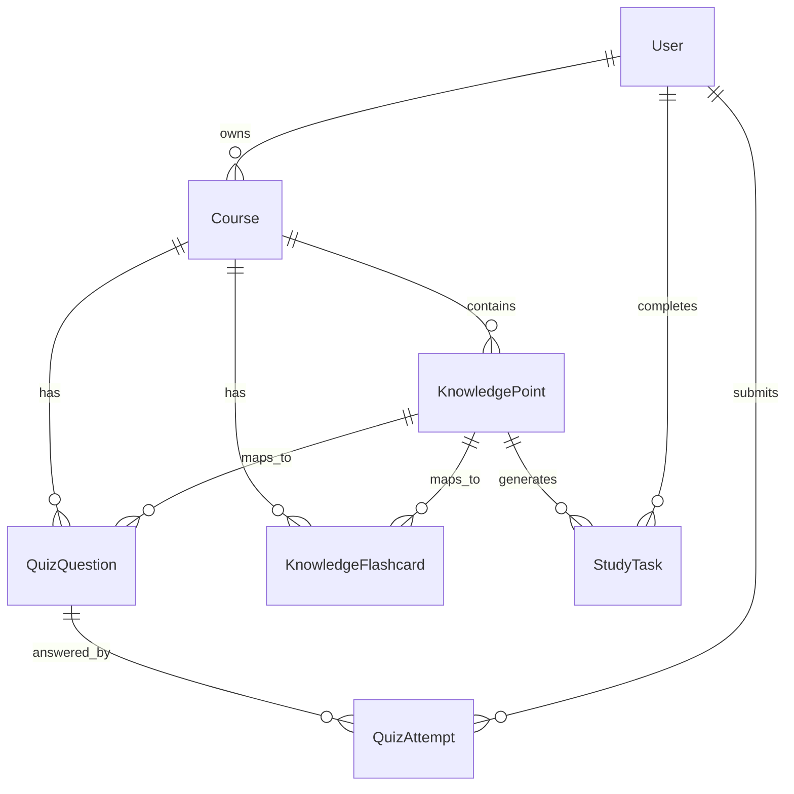

# 05 数据模型与题库规划

文档版本：v0.8
日期：2026-05-02

## 1. 数据设计原则

首版数据模型要服务于一个核心闭环：

课程 -> 知识点 -> 任务 -> 测验 -> 答题记录 -> 掌握度更新。

不要一开始把表设计得过度复杂。先保证核心流程能跑通，后续再扩展上传资料、LLM 生成题目和多人学习功能。

## 2. 核心实体

### 2.1 User

用户信息。

字段：

```text
id
name
email
daily_study_minutes
created_at
```

### 2.2 Course

课程信息。

字段：

```text
id
user_id
name
exam_date
difficulty
target_score
overall_progress
created_at
```

### 2.3 KnowledgePoint

知识点信息。

字段：

```text
id
course_id
title
chapter
difficulty
mastery_score
status
last_reviewed_at
created_at
```

### 2.4 StudyTask

复习任务。

字段：

```text
id
user_id
course_id
knowledge_point_id
date
task_type
duration_minutes
priority_score
status
created_at
```

### 2.5 QuizQuestion

题目信息。

字段：

```text
id
course_id
knowledge_point_id
type
question
options
answer
explanation
difficulty
source_type
source_title
source_detail
exam_value
exam_prompt
created_at
```

v0.2 已在 App 内加入题目来源字段：

- `source_type`：课件、辅导课、真题、期末题型、冲刺笔记。
- `source_title`：例如 `C310 Day1 真题矩阵`、`E320-T1.1 单层感知器`。
- `source_detail`：对应的章节、题型或考点范围。
- `exam_value`：1 到 5 的考场价值评分，用于优先刷高频题。
- `exam_prompt`：用户提交后看到的考场写法提示。

### 2.6 KnowledgeFlashcard

知识手卡信息，用于“今日”二级页面，把当天学习材料压成可主动回忆的知识卡。

字段：

```text
id
course_id
knowledge_point_id
day_label
title
prompt
answer
exam_hint
source_title
tags
priority
```

v0.8 已在 App 内把 C310 / E320 前两天知识手卡扩展为按课件笔记序号拆分的完整手卡：

- 总量：126 张，其中 C310 85 张、E320 41 张。
- C310：覆盖 Day1 C1-C2 与 Day2 C3-C4 的笔记结构，已按新双列课件笔记扩展为更完整的“图标 + 序号层级”手卡；长章节拆成 `[2.1.1]`、`[2.1.2]` 这类子卡。Day1 从 `[0]` 学习路径、`[1.1.1]` Agent 基础定义、`[2.1.1]` 标准定义三件套、`[3.1]` 环境属性、`[6.2]` see/action/next、`[7.1]` Expected Utility，到 `[18]` 卷面答题顺序。Day2 从 `[2.1]` symbolic reasoning、`[3.2]` theorem proving、`[9.1]` STRIPS、`[10.2]` BDI outer loop、`[13.1]` commitment、`[14.1]` reconsideration trade-off，到 `[23]` 45 分钟使用法。
- E320：覆盖 Day1 C1-C2 与 Day2 C3-C4 的笔记结构，从 `[1.1]` 课程定位、`[1.6]` labelled/unlabelled、`[2.2]` ILF 与输出公式、`[2.4]` activation functions，到 Day2 `[3.2]` learning rules、`[3.3]` error-correction、`[3.5]` learning paradigms、`[4.3]` perceptron training、`[4.4]` OR 表格、`[4.5]` AND/OR/XOR。
- C310 手卡信息库已切到 `C310-第一天-C1C2-双列课件笔记优化版.pdf` 与 `C310-第二天-C3C4-双列课件笔记优化版.pdf`；同步桥把 `双列课件笔记优化版` 标记为 `flashcard_source`，优先纳入本机快照。C310 卡面标题保留笔记序号层级并加入图标，例如 `[6.2] 👁️ see / action / next`、`[10.2] 🧭 BDI 外层主循环`。
- 每张手卡标题保留笔记序号，展开后显示来源、考查知识点、考试提示和重要程度。重要程度使用 `S 必考`、`A 高频`、`B 理解`、`C 浏览`，默认按高重要度优先排序。

### 2.7 QuizAttempt

答题记录。

字段：

```text
id
user_id
question_id
knowledge_point_id
selected_answer
is_correct
time_spent_seconds
confidence
created_at
```

## 3. 关系设计



## 4. 三门课知识点规划

### 4.1 多智能体系统

章节与知识点：

- Agent 标准定义三要素
- Agent vs Object / Expert System
- 环境属性与设计难度
- Reactive / Pro-active / Social Ability
- Intentional Stance
- see / action / next 与抽象架构
- Expected Utility
- Predicate / Achievement / Maintenance Task
- Symbolic / Deductive Reasoning Agent
- Agent0 与 Agent-Oriented Programming
- Deliberation 与 Means-End Reasoning
- STRIPS 与 Plan Correctness
- BDI 控制循环与 Commitment
- 多智能体通信
- 协作与协调
- 任务分解
- 博弈与策略
- 一致性与共识
- 多智能体系统评估

### 4.2 云计算

章节与知识点：

- IaaS、PaaS、SaaS
- 虚拟化
- 容器与 Docker
- Kubernetes 基础
- Serverless
- 云存储
- 负载均衡
- 自动扩缩容
- 监控与日志
- 云安全基础

### 4.3 神经网络

章节与知识点：

- ANN 动机、抽象与优势边界
- Training / Online / Test 与 Labelled Data
- 单神经元 ILF、输出与 Bias Trick
- Activation Function 机制与选择
- Feedforward / CNN / Recurrent Topology
- Learning 定义与 Free Parameters
- 五类 Learning Rules
- Supervised / Unsupervised / Reinforcement
- LLS vs LMS
- Perceptron Decision Rule 与 Update Table
- AND / OR / XOR 线性可分性
- 反向传播
- 过拟合与正则化
- CNN
- RNN
- Transformer
- 模型评估

## 5. 题库策略

首版目标每门课准备 20 到 30 道题；v0.6 已把真实资料驱动题库扩到 106 道，全部整理为由浅入深的选择题，覆盖：

- C310：46 道，来自 C1-C2 / C3-C4 最新双列课件笔记、C4 with solutions、Day1 真题矩阵、C6&7 通信、本体论、C8/C11 协同、C12/C13/C14/C15-C18 高频题型。v0.6 重点补入 Agent vs expert system、dynamic/partial observable、transduction、deductive agent、Agent0、STRIPS、sound/reconsider、commitment 等细分考点。
- E320：46 道，来自 C1-C2 / C3-C4 最新双列课件笔记、Tutorial T1-T5、21/22 到 24/25 期末题型整理、SLP、Backprop、RBF、SVM、SOM、过拟合与复杂度控制。v0.6 重点补入 training/online/test、labelled samples、ILF 计算、bias 约定、topologies、learning rules、credit assignment、LLS/LMS、perceptron 表格、XOR 等细分考点。
- C315：14 道，作为 5 月 14 日前的保温题库，覆盖服务模型、虚拟化、容器、Kubernetes、Serverless、负载均衡、自动扩缩容。

v0.6 手机端练习入口采用“今日可见题库”策略：全量题库保留，但当前只展示 C310 / E320 前两天学习范围内的 67 道题，避免用户在当天学习任务中被后续章节稀释注意力。新增题目的解析统一使用“解析拆分”格式：考点定位、正确项原因、常见误区、卷面写法，目标是检验笔记内容和考试相关知识点是否真正吸收。

题型比例：

- 选择题：60%
- 判断题：25%
- 简答题：15%

题目难度：

- easy：基础概念
- medium：对比理解
- hard：应用分析

首版自动评分范围：

- 选择题自动评分。
- 判断题自动评分。
- 简答题由用户自评，后续再接入 AI 批改。

## 6. 掌握度更新规则

首版可以用规则算法：

```text
如果答对且自信度高：mastery_score + 0.08
如果答对但自信度低：mastery_score + 0.03
如果答错：mastery_score - 0.10
如果超过 3 天未复习：mastery_score - 0.05
```

限制：

```text
mastery_score 最低为 0
mastery_score 最高为 1
```

后续神经网络版本用模型输出替换规则算法。

## 7. 数据种子文件

当前种子数据文件：

```text
data/knowledge_base_seed.json
```

用途：

- 给 iOS 本地 MVP 导入课程和知识点。
- 给后端数据库初始化。
- 给题库设计提供结构参考。
